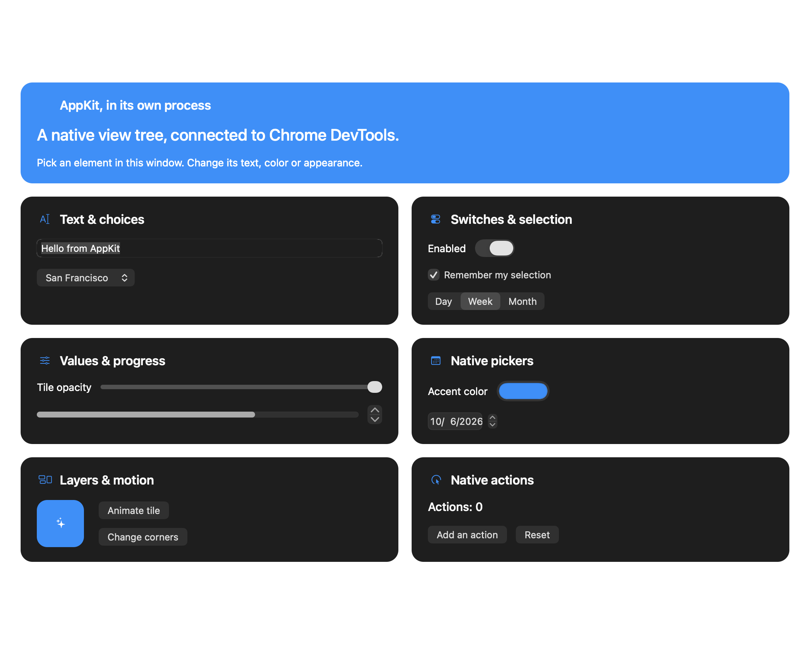
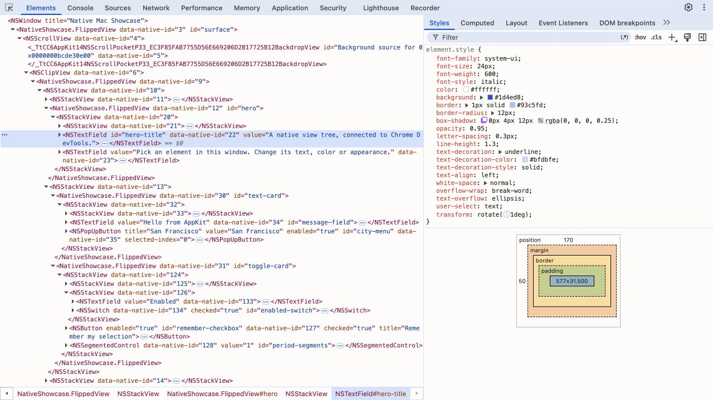

# MacInspector

Chrome DevTools for native macOS and iOS apps.

Native UI debugging should be as immediate as web debugging: pick a control,
inspect its properties, change its appearance and see the result. MacInspector
brings that workflow to AppKit, UIKit and registered SwiftUI views, with native breakpoints and line-by-line
stepping in the same window.

- **Elements:** the real native hierarchy, with tags such as `<NSTextField>`,
  editable text children, control attributes, bounds and dropdown items. Pick
  controls directly in the app. Single-line inputs keep their `value` attribute.
- **Styles:** edit colors, fonts, shadows, transforms, text formatting, sizes and
  native stack spacing live. Appearance stays in the right panel, keeping the element
  tree readable.
- **Sources:** read Swift with syntax highlighting, set breakpoints, step through
  native code and inspect variables through LLDB.
- **Native Layout:** inspect real Auto Layout constraints, intrinsic sizes, hugging
  and compression resistance. Highlight relationships and edit constants live.
- **Event Listeners:** see native control handlers with source links when debug
  symbols are available. AppKit also exposes menu actions and gesture recognizers.
- **Native Changes:** review edits, undo or redo, export Swift and save overrides
  to reapply after relaunch.



## Install and try it

Requires **macOS 13+**, **Node.js 22+**, **Google Chrome**, and **Xcode or the
Xcode Command Line Tools** with Swift, LLDB and a macOS 14.4+ SDK.

```sh
git clone https://github.com/dashersw/macinspector.git
cd macinspector
npm install
npm run demo
```

This builds and launches the included Swift/AppKit showcase and opens DevTools
in Chrome. The frontend includes Swift highlighting; no browser extension is
needed. The first install downloads its pinned DevTools assets.

Use **⌘+** / **⌘−** to zoom the inspector UI and **⌘0** to reset it.
The zoom level is saved across reloads.

For the UIKit demo, install full Xcode and an iOS Simulator runtime, then run
`npm run demo -- --platform ios`. See [iOS setup](#inspect-an-ios-app) to use it
with your own app.

The CLI chooses free loopback ports and prints the preview and DevTools URLs.
It prefers **9333** for DevTools when available. **Ctrl+C** stops the debugger
and its demo app.

## Inspect and debug

1. In **Elements**, enable the picker with **⌘⇧C**, then click a control in the
   native app. Inspector clicks select the control without activating it.
2. Select an element and edit its appearance in **Styles**. Toggle declarations
   to compare changes. Expand a dropdown to inspect its native menu items.
3. In **Sources**, open `demo/macos/main.swift`. Set a breakpoint on
   `incrementCount()` inside `increment()`, then click **Add an action** in the
   app. Use **F11** to step in, **F10** to step over, and **F8** to resume.
   Add `self.actionCount` to **Watch** to see the native value change.




```sh
# Choose different ports, or open DevTools yourself.
node bin/macinspector.mjs demo --port 9343 --native-port 9344
node bin/macinspector.mjs demo --no-open

# Inspect the UI without attaching LLDB.
node bin/macinspector.mjs demo --no-source-debug
```

## Use it with another app

Choose a running app interactively, or attach by name or bundle ID. The CLI
finds its SDK connection automatically, chooses a free port and opens DevTools.
If the app has no SDK connection, it falls back to macOS Accessibility:

```sh
node bin/macinspector.mjs attach
node bin/macinspector.mjs attach "Native Mac Showcase"
node bin/macinspector.mjs attach com.dashersw.macinspector.showcase --source-debug

# List running apps and their PIDs; use --json for scripts.
node bin/macinspector.mjs apps

# A specific PID is useful when multiple instances have the same bundle ID.
node bin/macinspector.mjs attach --pid 12345
```

Names and bundle IDs match exactly, ignoring case. Ambiguous matches report the
matching processes so you can choose explicitly. The list contains user-facing
GUI apps; use `--pid` for background processes. **Ctrl+C** closes the inspector
and leaves the attached app running.

| Capability                       | AppKit SDK                                                 | macOS Accessibility fallback          |
| -------------------------------- | ---------------------------------------------------------- | ------------------------------------- |
| Tree and picker                  | Actual native views and menus                              | Published accessible controls         |
| Values and actions               | Supported native controls                                  | What the app exposes to Accessibility |
| Styles, constraints, screenshots | Yes                                                        | No                                    |
| Native event registrations       | Control/menu actions and gesture recognizers               | No                                    |
| Native breakpoints and stepping  | `--source-debug`, with debug symbols and attach permission | Same LLDB requirements                |

Grant the `.build/debug/AccessibilityBridge` helper access in **System Settings
→ Privacy & Security → Accessibility**. This mode exposes the controls, values
and actions the app publishes to Accessibility. It has no general appearance
editing and may omit custom drawing.

For the full view hierarchy and live appearance edits, add **MacInspector** to
your AppKit debug build using the steps below. It walks the actual native views;
you do not need to register individual controls.

## Add MacInspector to an Xcode project

1. Choose **File → Add Package Dependencies** and enter
   `https://github.com/dashersw/macinspector.git`. Select **Branch: main** and
   add the **MacInspector** library product to your macOS app target.
2. Add this import at the top of your app delegate or window controller file:

   ```swift
   #if DEBUG
   import MacInspector
   #endif
   ```

   Put this property and method **inside that class**:

   ```swift
   #if DEBUG
   private var inspector: NativeInspector?

   func startInspector(window: NSWindow) throws {
       let instance = NativeInspector(window: window)
       try instance.start()
       inspector = instance
   }
   #endif
   ```

   Call it once on the main thread after creating the window:

   ```swift
   #if DEBUG
   try startInspector(window: window)
   #endif
   ```

   Retain the inspector property for as long as you want the window inspected.

3. For a sandboxed app, allow **Incoming Connections (Server)** for your debug
   target under **Signing & Capabilities → App Sandbox**. No scheme variables,
   fixed ports or copied tokens are needed. The SDK generates a secret, binds to
   loopback and publishes a connection record readable only by your user.
4. Run your app, then attach from this repository:

   ```sh
   node bin/macinspector.mjs attach "My App"
   ```

   Chrome opens with the native tree, live styles, layout, changes, console and
   picker. **Ctrl+C** closes the inspector and leaves your app running.

To use Chrome for native breakpoints and stepping, build **Debug**, uncheck
**Edit Scheme → Run → Info → Debug executable** so Xcode is not already attached,
and use `node bin/macinspector.mjs attach "My App" --source-debug`. Use your
actual running app name or bundle ID. macOS must permit LLDB to attach; hardened debug
builds need the `com.apple.security.get-task-allow` entitlement.

Source debugging needs debug symbols, available source files and permission to
attach LLDB. While paused, the inspector keeps the last UI snapshot; resume to
apply UI edits. Optimized or stripped apps limit source debugging. SwiftUI uses
public SDK modifiers and bindings; see the setup below.

## Inspect an iOS app

Requires full Xcode with an installed iOS Simulator runtime. Run the included
UIKit showcase:

```sh
node bin/macinspector.mjs demo --platform ios
# Choose an installed simulator by name or UDID:
node bin/macinspector.mjs demo --platform ios --simulator "iPhone 17"
```

The CLI builds the app, boots a simulator, installs it and opens DevTools with
native source debugging enabled. It prefers a runtime compatible with the active
Xcode SDK. In Sources, open `demo/ios/Showcase.swift`, set a breakpoint on
`incrementCount()` inside `increment()`, then tap **Add an action**. Step in,
inspect `self.actionCount`, and resume. Turn the picker off before triggering a
control's action. **Ctrl+C** closes the inspector and its
demo app; the simulator stays open.

For your app (**iOS 16+**), choose **File → Add Package Dependencies** in Xcode,
enter `https://github.com/dashersw/macinspector.git`, select **Branch: main**, and
add the **MacInspector** library product to your iOS target. Add the guarded
import and retained property/method to your scene delegate or window owner:

```swift
#if DEBUG
import MacInspector
#endif
```

```swift
#if DEBUG
private var inspector: NativeInspector?

func startInspector(window: UIWindow) throws {
    let instance = NativeInspector(window: window)
    try instance.start()
    inspector = instance
}
#endif
```

After creating your view controller and calling `window.makeKeyAndVisible()`,
initialize the inspector on the main thread with that actual `UIWindow`:

```swift
#if DEBUG
do {
    try startInspector(window: window)
} catch {
    print("MacInspector: \(error.localizedDescription)")
}
#endif
```

Run the Debug build, detach Xcode's debugger, then attach using its bundle ID:

```sh
node bin/macinspector.mjs attach com.example.myapp --platform ios --source-debug
# Inspect the UI while leaving Xcode's source debugger attached:
node bin/macinspector.mjs attach com.example.myapp --platform ios
```

UIKit supports the native view tree, editable appearance, control values/actions,
touch picker, screenshots, Auto Layout, changes/undo, saved overrides and simulator
breakpoints/stepping. Menus expose `UIMenu`/`UIAction` titles and state. Control
listeners use UIKit's public target/action API; gesture target lists and closure
bodies are unavailable. iOS requires the SDK; there is no Accessibility fallback.
In Simulator, the picker continuously highlights the view under the Mac pointer
before clicking. Keep the target window visible with device bezels enabled.
Automated attachment and source debugging currently target Simulator. Physical
device discovery, USB forwarding and remote LLDB are not implemented.

See [UIKit support and limits](docs/usage.md#uikit-and-ios-simulator) for details.


## Inspect a SwiftUI app

SwiftUI support uses **public bindings**, on macOS and iOS. Register the views
and properties you want to inspect; edits write into the same state your app uses
to render. App controls, animations and redraws update DevTools in turn.

```sh
# The same SwiftUI showcase on both targets, with LLDB enabled:
node bin/macinspector.mjs demo --ui swiftui
node bin/macinspector.mjs demo --ui swiftui --platform ios
```

Add the **MacInspector** library through Xcode's Package Dependencies as described
above. In your Debug build, add `.macInspectorRoot()` to the window's root view
and register properties beside the SwiftUI modifiers that use them:

```swift
import SwiftUI
import MacInspector

struct ContentView: View {
    @State private var width = 72.0
    @State private var fill = Color.blue

    var body: some View {
        Rectangle()
            .fill(fill)
            .frame(width: width, height: 72)
            .macInspector(id: "tile", properties: [
                .numberStyle("width", $width, range: 0...300),
                .color("background-color", $fill)
            ])
    }
}

// In WindowGroup, or the root view passed to NSHostingView/UIHostingController:
// ContentView().macInspectorRoot()
```

Attach by app name on macOS, or bundle ID with `--platform ios` in Simulator.
Use `--source-debug` for native breakpoints. The modifiers are inert in the SDK's
Release build; keep inspector imports and registration in your Debug integration.

Elements shows registered logical views such as `<SwiftUI.Text>`. Styles shows
only registered properties. Text fields, toggles, pickers, sliders, dates and
registered button closures use their actual bindings/actions. IDs remain stable
through redraws; removed views become invalid targets. Undo, redo and saved
changes work through these bindings too.

Unregistered SwiftUI views are not enumerated automatically. Derived labels can
be inspected but need a writable binding for editing. SwiftUI manages layout;
edit registered frame/spacing bindings rather than Auto Layout constraints.
This does not expose private SwiftUI internals or arbitrary CSS on unmodified views.
See [SwiftUI integration and testing](docs/swiftui.md) for the property API,
source debugging, overrides and limits.


## Inspect native layout

Select a view in **Elements → Native Layout**. The panel shows constraints,
priorities, intrinsic sizes, ambiguity and autoresizing-mask translation. Hover a
constraint to highlight its related views in the app. Change its constant,
priority or active state directly; press Enter or leave the field to save.
Hugging and compression priorities are also editable. Values use native points.
Relationships are grouped by size and axis. **This view** shows direct constraints;
**All affecting** includes constraints the native framework uses to resolve layout.
Controls are labeled by their identifier or text; saved hierarchy paths stay internal.

In **Styles**, `width: 120px` and `height: 60px` create native size constraints
at priority 999. They temporarily replace direct fixed-size constraints; deleting,
disabling or setting the declaration to `auto` restores the previous layout.
Required relationships remain active, and conflicting edits roll back. See
[size edits](docs/usage.md#size-edits) for supported values and requirements.

Give important constraints unique identifiers to make saved edits stable:

```swift
let width = tile.widthAnchor.constraint(equalToConstant: 64)
width.identifier = "tile.width"
width.isActive = true
```


## Inspect native handlers

Select a control in **Elements → Event Listeners**. Expand **action** to see its
AppKit target and selector, then follow the source link to set a native breakpoint.
UIKit controls expose events such as **touchUpInside** and **valueChanged**.
Gesture recognizers appear under their native class names. Handler properties
include the selector, target class, dispatch through an explicit target or the
responder chain, and enabled state. Internal AppKit handlers are visible too.

`getEventListeners($0)` in Console lists the latest snapshot's handler metadata.
The CDP endpoint implements `DOMDebugger.getEventListeners`, including subtree
queries. These are native registrations: browser capture/passive/once flags do
not apply. Removing handlers or toggling passive dispatch is disabled. Notifications,
Combine subscriptions, delegates and arbitrary closures are not enumerated.
Accessibility attachment cannot expose these registrations.

Source links need LLDB, matching debug symbols and local source files. The demo
enables LLDB by default; for another app, use
`node bin/macinspector.mjs attach "My App" --source-debug` with a Debug build.
If a link opens handler metadata, its message distinguishes source debugging
being disabled, an unresolved handler address, or enabled debugging with no
readable source. Internal framework handlers often have no available source; this
does not prevent breakpoints or stepping in your own app's code. In the demo,
**Add an action → `increment()`** opens the Swift handler.


## Keep your edits

Open **Native Changes** beside Elements. Styles, native attribute edits and
constraint edits share one history. Use **Undo**, **Redo**, or **Undo this change**.
Overlapping later edits must be undone first; control actions are not undoable.

**Save overrides** downloads a JSON file. Load it from the panel or reapply it
when attaching:

```sh
node bin/macinspector.mjs attach "My App" --overrides macinspector-overrides.json
# Save the current overrides when Ctrl+C closes the inspector:
node bin/macinspector.mjs attach "My App" --save-overrides macinspector-overrides.json
```

**Export Swift** downloads a snippet calling `inspector.applyOverrides(...)`.
Put it after creating your views in a debug build. Overrides prefer unique view
and constraint identifiers; hierarchy paths are checked against native classes.
They do not rewrite your source files or replace Auto Layout.

See the [integration guide](docs/usage.md) for console examples, supported style
properties and frontend details.


## Development

```sh
npm run check
npm test
swift test --jobs 1
```

See the [integration guide](docs/usage.md) for frontend and debugging details.

## License

[MIT](LICENSE).
Bundled dependencies include their own license files.
