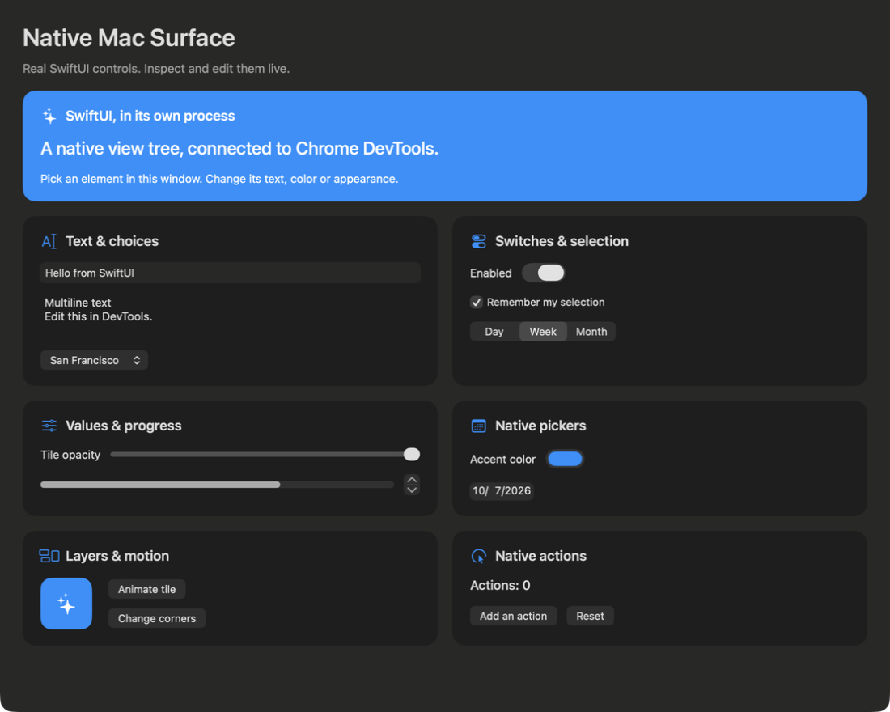
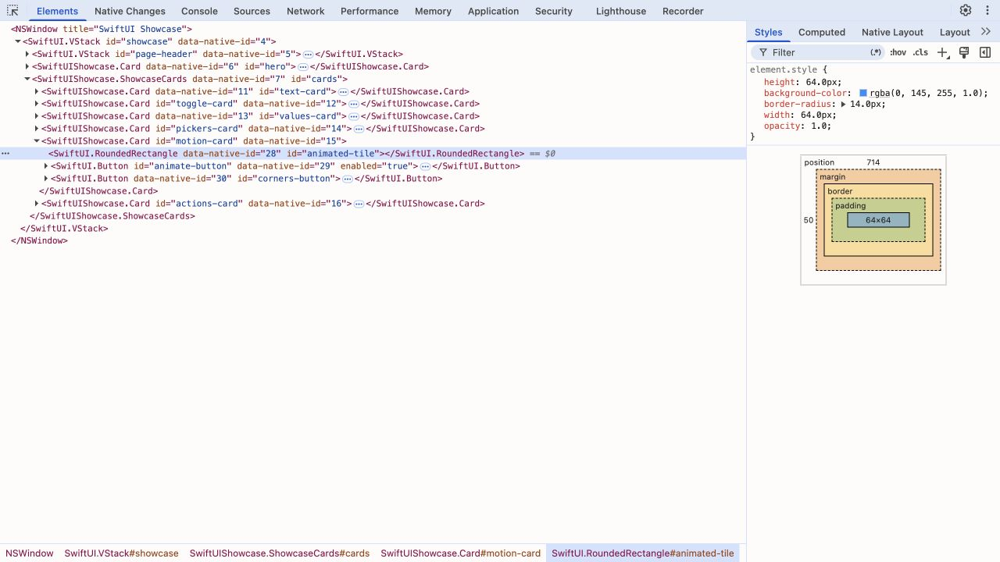
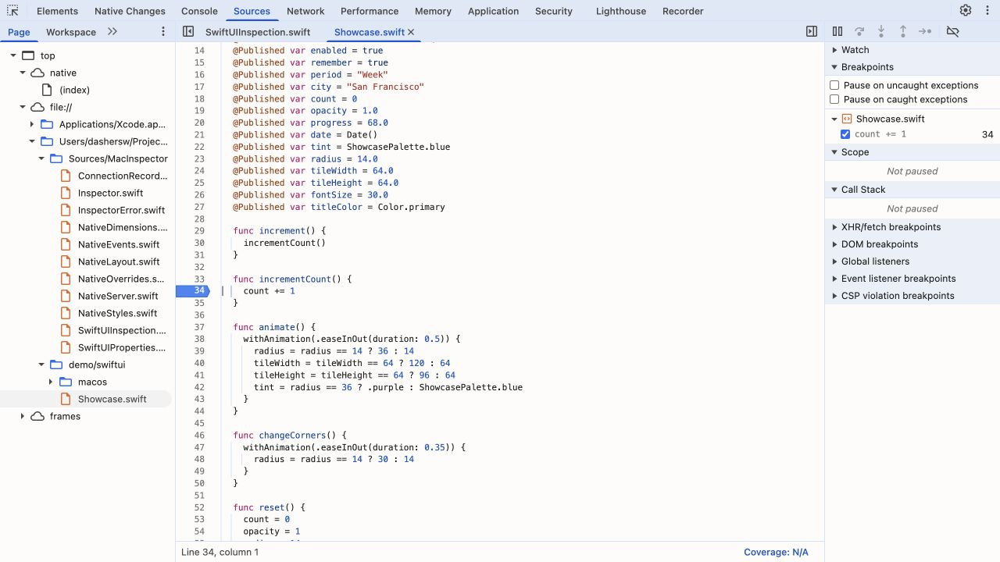

# SwiftUI integration

MacInspector exposes registered logical SwiftUI views on macOS 13+ and iOS 16+.
It uses public `Binding` and view modifiers. It neither reads nor rewrites
SwiftUI's private runtime tree.

## Try both targets

```sh
node bin/macinspector.mjs demo --ui swiftui
node bin/macinspector.mjs demo --ui swiftui --platform ios
# Choose your simulator:
node bin/macinspector.mjs demo --ui swiftui --platform ios --simulator "iPhone 17"
```

Both targets render `demo/swiftui/Showcase.swift`: the same header, blue hero,
six cards, native controls and system colors as the AppKit showcase. The macOS
window starts at 1100 × 880 points, with 28-point content insets, 18-point gaps
and two equal-width card columns. Below a 780-point window width, the cards
stack into one column. A public SwiftUI `Layout` keeps every demo control mounted
for inspection. The macOS demo explicitly creates an AppKit window containing
`NSHostingView`; the UI itself is SwiftUI.
The iOS demo uses a SwiftUI `App` and `WindowGroup`. Text fields, a multiline
editor, toggles, pickers, a stepper, a slider, a progress bar, color/date pickers
and buttons all use real SwiftUI state.

Select `#animated-tile` in Elements. Edit its background, opacity, width, height
or radius in Styles. Click **Animate tile** in the app: its new binding values and
rendered bounds appear in DevTools. Delete or disable an edit to restore the
binding value captured before that property was first edited. **Change corners**
animates the radius separately. Each card also has its own editable background
and corner radius. Turning **Enabled** off replaces the hero description with a
pause message, demonstrating logical node mounting and removal.





## Add the SDK in Xcode

Choose **File → Add Package Dependencies**, enter
`https://github.com/dashersw/macinspector.git`, select **Branch: main**, and add
the **MacInspector** library to your target. Use a Debug build. In a sandboxed
macOS target, enable **Incoming Connections (Server)** for debug inspection.

Import `MacInspector` and apply `.macInspectorRoot()` once to the root content
of the inspected window:

```swift
WindowGroup {
    ContentView().macInspectorRoot()
}
```

This also works with the root SwiftUI view passed to `NSHostingView` or
`UIHostingController`. The modifier retains the inspector, chooses a loopback
port and publishes SDK discovery. Do not also start another `NativeInspector`
on that same window. The SDK's Release build makes the modifiers inert. Guard
imports and registration with `#if DEBUG` if the SDK is linked only to your debug
target. Each inspected window needs its own root; discovery currently advertises
one connection per process, so inspect one window at a time.

Attach without configuring ports or copying secrets:

```sh
node bin/macinspector.mjs attach "My App" --source-debug
node bin/macinspector.mjs attach com.example.myapp --platform ios --source-debug
```

## Register actual bindings

Register each logical view you want to inspect. Container registrations establish
parent/child relationships. Use stable, unique IDs; include a model identifier
inside `ForEach`, for example `id: "item-\(item.id)"`. Do not use a transient array
index when items can move.

```swift
struct ContentView: View {
    @State private var title = "Hello"
    @State private var fontSize = 28.0
    @State private var textColor = Color.primary
    @State private var width = 72.0
    @State private var fill = Color.blue

    var body: some View {
        VStack {
            Text(title)
                .font(.system(size: fontSize))
                .foregroundStyle(textColor)
                .macInspector(id: "title", properties: [
                    .text($title),
                    .numberStyle("font-size", $fontSize, range: 8...96),
                    .color("color", $textColor)
                ])

            Rectangle()
                .fill(fill)
                .frame(width: width, height: 72)
                .macInspector(id: "tile", properties: [
                    .numberStyle("width", $width, range: 0...300),
                    .color("background-color", $fill)
                ])
        }
        .macInspector(id: "content", tag: "SwiftUI.VStack")
    }
}
```

The same binding must appear in both the SwiftUI rendering modifier and the
registration. Registration alone does not add a font, frame or background.
Changing that binding elsewhere in the app updates the snapshot; DevTools writes
it on the main thread. A rejected style transaction restores all affected bindings.
Removing an edit restores the original typed value, preserving semantic `Color`
values rather than replacing them with a flattened CSS string.

| Property                     | Registration                                           | Actual view usage                              |
| ---------------------------- | ------------------------------------------------------ | ---------------------------------------------- |
| Editable text children       | `.text($title)`                                        | `Text(title)` / `TextEditor(text: $title)`     |
| Derived, read-only text      | `.text("Actions: \(count)")`                           | The same derived label                         |
| Single-line input            | `.value($message)`                                     | `TextField(..., text: $message)`               |
| Picker selection             | `.value($city, choices: cities)`                       | `Picker(..., selection: $city)`                |
| Integer value                | `.value($count, range: 0...100)`                       | `Stepper(..., value: $count)`                  |
| Floating value               | `.value($opacity, range: 0...1)`                       | `Slider(value: $opacity)`                      |
| Toggle state                 | `.checked($enabled)`                                   | `Toggle(..., isOn: $enabled)`                  |
| Enabled state                | `.enabled($enabled)`                                   | `.disabled(!enabled)`                          |
| Date value                   | `.date($date)`                                         | `DatePicker(..., selection: $date)`            |
| Point-valued style           | `.numberStyle("border-radius", $radius)`               | `RoundedRectangle(cornerRadius: radius)`       |
| Unitless style               | `.numberStyle("opacity", $opacity, range: 0...1)`      | `.opacity(opacity)`                            |
| Color style                  | `.color("background-color", $fill)`                    | `.fill(fill)` / `.background(fill)`            |
| Intrinsic or fixed dimension | `.dimension("width", $optionalWidth)`                  | `.frame(width: optionalWidth)` with `CGFloat?` |
| Enumerated string style      | `.stringStyle("font-family", $family, allowed: fonts)` | `.font(.custom(family, size: size))`           |

Numbers and `px` use **native points**. Register a meaningful range that your UI
supports. Required numeric dimensions do not accept `auto`; the optional
`dimension` binding accepts it as `nil`. Pickers expose their registered selection
value, with validation against `choices`; their closed SwiftUI menu items are not
currently projected as children. An explicit `tag:` is useful for shapes or heavily
wrapped types. Most controls infer tags such as `SwiftUI.TextField`.

## Actions and native source debugging

Pass the same public action closure as the Button:

```swift
Button("Add an action", action: model.increment)
    .macInspector(id: "count-button", properties: [.text("Add an action")],
        action: .init("increment", perform: model.increment))
```

Console can invoke `$("#count-button").click()`. Event Listeners exposes the
registered closure name and its registration file/line. With source debugging,
the source link opens that Swift file; it is a registration-site link, not a
claim that Swift closures have Objective-C implementation addresses. You can
supply `file:` and `line:` to `SwiftUIAction` when registering from a helper.
Unregistered closures, Combine subscriptions and gesture internals are not discovered.

The demo enables LLDB by default. Open `demo/swiftui/Showcase.swift` in Sources,
break on `incrementCount()` inside `increment()`, disable the picker, and click
**Add an action**. **F11** steps in, **F10** steps over, **Shift+F11** steps out,
and **F8** resumes. Watch `self.count`. `@Published` accessors can produce extra
line stops before the setter completes. Breakpoints and variable evaluation run
against the actual compiled app, on both targets.



For your own app, build Debug with symbols and local source files, detach Xcode's
debugger first, and attach with `--source-debug`. macOS hardened debug builds
need `com.apple.security.get-task-allow`. The iOS workflow currently targets
Simulator. While paused, UI inspection keeps its last snapshot; resume before
editing bindings. Swift source hot reload is not implemented.

## Changes and saved overrides

Native Changes shares undo/redo and JSON overrides with the other adapters.
Stable IDs let you reapply edits to newly created logical nodes:

```sh
node bin/macinspector.mjs attach "My App" --save-overrides swiftui-edits.json
# After relaunching the app:
node bin/macinspector.mjs attach "My App" --overrides swiftui-edits.json
```

Overrides target registered, mounted views and registered properties. Missing,
ambiguous or incompatible targets are rejected; a failed replay rolls back its
writes. Lazy views may not be mounted until scrolled into view. Apply their
saved edits after they mount. The SDK also supports the exported Swift snippet:
obtain its retained inspector in `.macInspectorRoot(onConnect: { inspector in ... })`
and call `try inspector.applyOverrides(data)` there after the target UI is mounted.
Catch errors in that callback instead of terminating your app.

## Picking, layout and limits

Invisible public `NSViewRepresentable` / `UIViewRepresentable` probes report
actual rendered frames without intercepting input. Picking and highlights use
these frames, including scroll clipping. Logical child nodes take precedence
when registered bounds overlap. Removed views reject stale edits; duplicate IDs
reject ambiguous writes. The preview remains a screenshot of the actual app. On macOS it uses
ScreenCaptureKit's current-process API (macOS 14.4+) to capture only the inspected
window, without requesting desktop recording permission. This includes composited
SwiftUI and native controls that AppKit view caching cannot capture reliably.
On macOS 13–14.3, SwiftUI screenshots are unavailable; tree, bindings, picking
and source debugging remain supported.

Only registered views/properties/actions are exposed. Registration adds modest
view/probe overhead, so use it in debug builds. SwiftUI owns layout; there are no
fabricated Auto Layout constraints. Register frame, padding or spacing bindings
and edit those in Styles. Styles reports the bound model values; a running
animation's interpolated presentation values are not sampled separately.
Read-only derived text requires a writable binding before it can be edited.
Secure text should not be registered for inspection unless you intend to expose it.

## Verification

```sh
swift test --jobs 1 --filter SwiftUITests
npm test

# With both demos running:
MACINSPECTOR_TEST_SWIFTUI_URL=ws://127.0.0.1:9353/devtools/page/native \
MACINSPECTOR_TEST_SWIFTUI_IOS_URL=ws://127.0.0.1:9363/devtools/page/native \
node --test --test-concurrency=1 test/swiftui.integration.test.mjs
```

The live tests exercise text/control write-back, appearance/size changes, app-driven
animation updates, stable identity, picking, undo/redo, disabling/deleting styles,
reconnection, mount/unmount and real LLDB breakpoint/step/variable operations.
