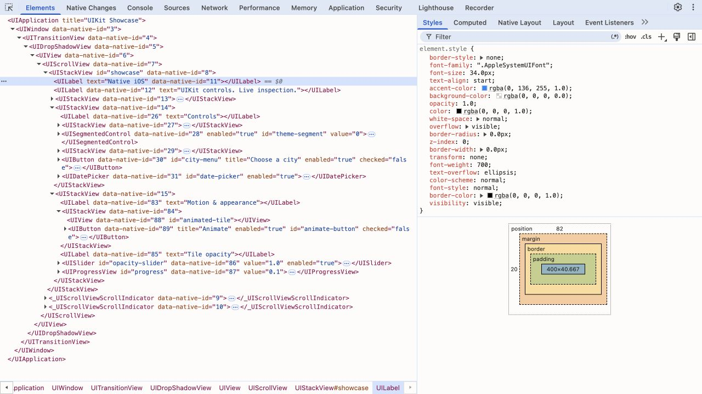
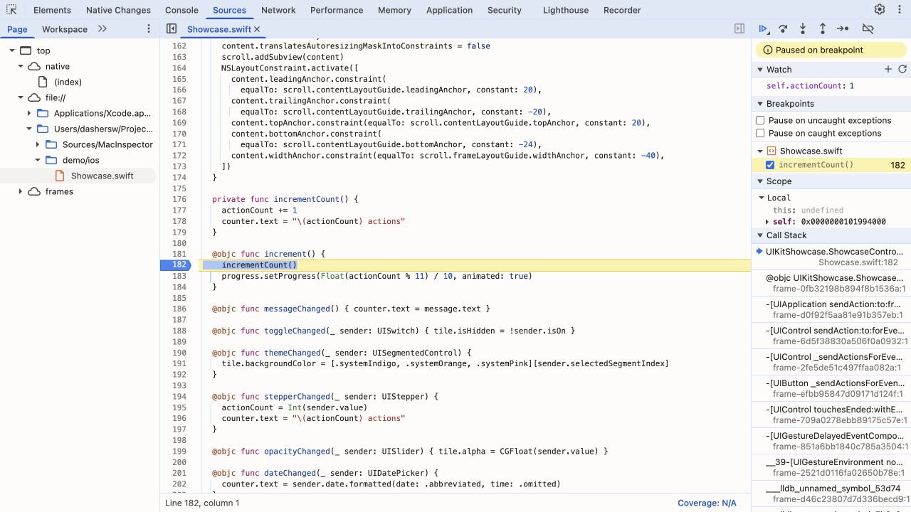
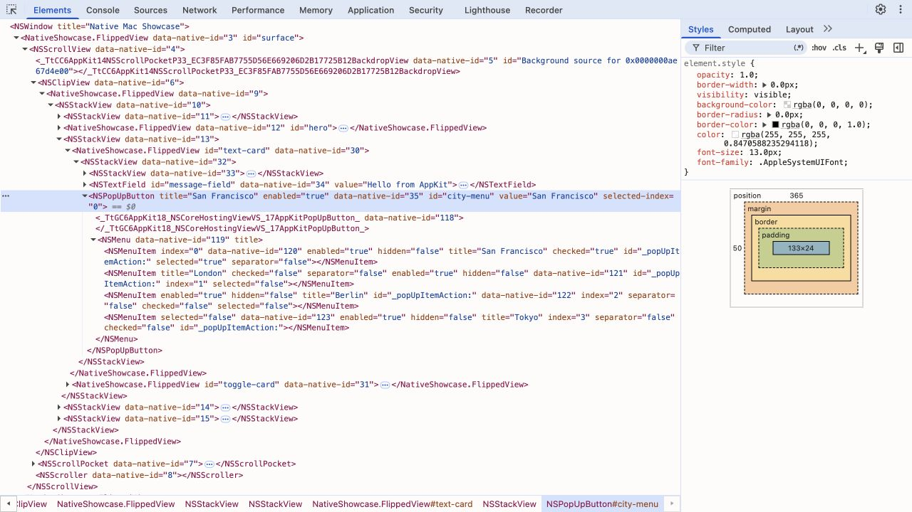
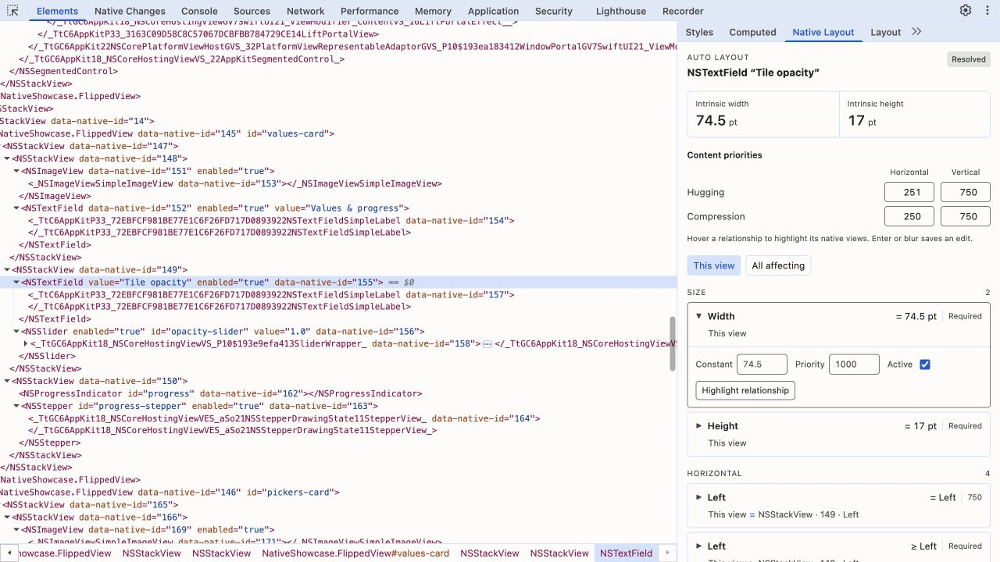
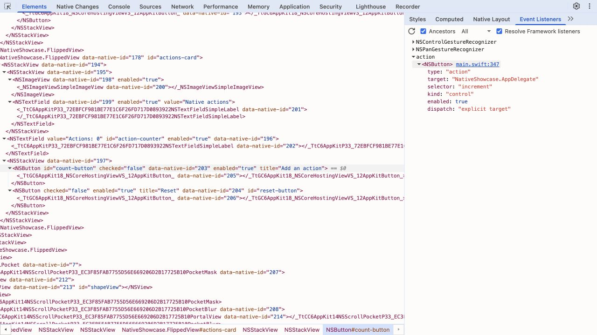
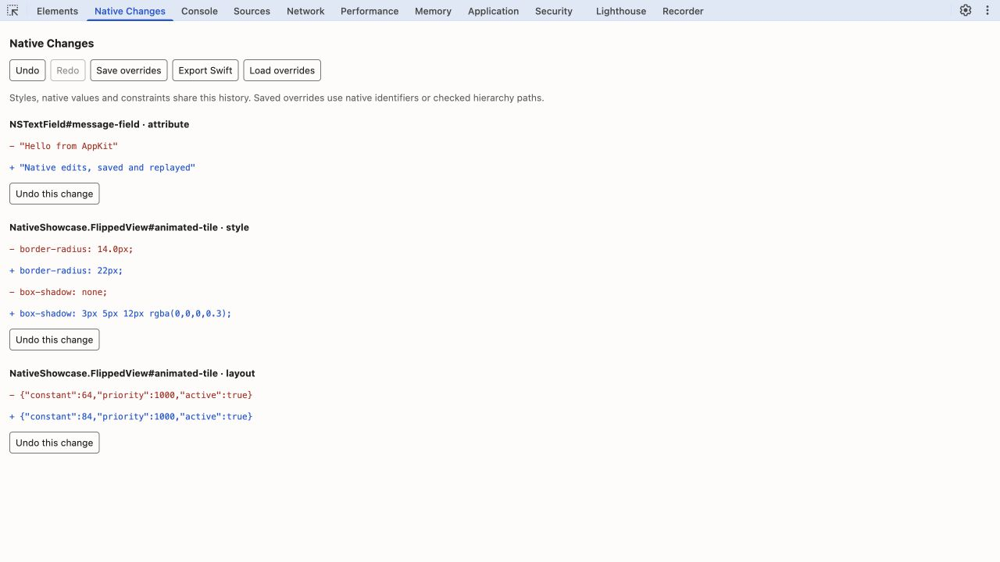
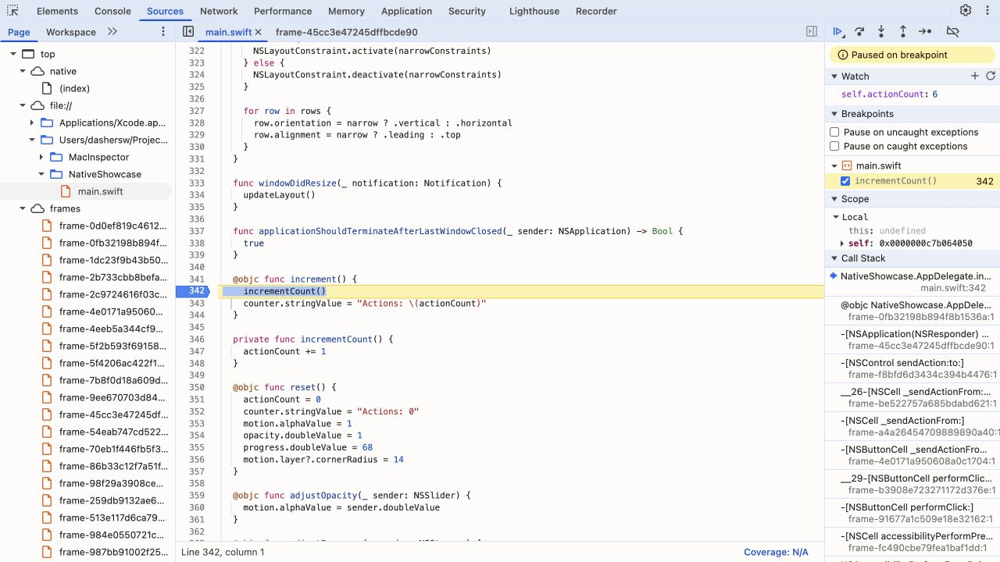

# Native integration and debugging

## Inspect your own AppKit app

Add this repository as a Swift Package dependency and link **MacInspector** into
your debug target. Retain the inspector after your window is ready:

```swift
#if DEBUG
import MacInspector
#endif

// Inside your app delegate or window controller:
#if DEBUG
private var inspector: NativeInspector?

func startInspector(window: NSWindow) throws {
    let instance = NativeInspector(window: window)
    try instance.start()
    inspector = instance
}
#endif
```

Call `startInspector(window:)` on the main thread after building your views.
No per-control registration is needed. All SDK operations run on the main thread.

```sh
node bin/macinspector.mjs attach "My App"
node bin/macinspector.mjs attach com.example.myapp --source-debug
node bin/macinspector.mjs attach --pid 12345
```

The CLI resolves app identity, discovers the SDK, chooses a free relay port and
opens its bundled DevTools. Only `--source-debug` attaches LLDB; an existing Xcode
debugger must be detached first. Explicit `--port` values fail if occupied.
Without an SDK connection, `attach` uses Accessibility and reports its reduced
capabilities. An advertised SDK that rejects attachment produces an error rather
than silently falling back. Only one relay can connect to an SDK at a time.

Discovery records live in `~/Library/Application Support/MacInspector/Connections`
(or the app's sandbox container), in a private directory with private files. The
SDK generates a random secret and uses a free loopback port. The relay checks file
ownership, permissions, process identity and session identity. `stop()` removes
the SDK's record. Keep SDK initialization inside `#if DEBUG`. Sandboxed debug apps
need the Incoming Connections entitlement. `connectionError` reports asynchronous
listener/discovery failures.

For integrations that manage their own connection, `start(port:token:)` remains
available. Use `connect --native-port <port> --token <secret>`; append
`--source-debug --app "My App"` or `--pid <pid>` for LLDB. `MACINSPECTOR_TOKEN` can
supply the token instead of the command line. Prefer automatic attach for normal
use.

## UIKit and iOS Simulator

The **MacInspector** Swift Package product supports iOS 16+ as well as macOS.
The simulator workflow requires full Xcode and an installed iOS Simulator runtime.
In Xcode, choose **File → Add Package Dependencies**, enter
`https://github.com/dashersw/macinspector.git`, select **Branch: main**, and add
the **MacInspector** library product to your iOS app target. Initialize
`NativeInspector(window:)` with
your scene's `UIWindow` on the main thread after creating the view controller
and making the window visible. Retain the instance in the scene delegate or
window owner and keep initialization/imports inside `#if DEBUG`.

```swift
#if DEBUG
import MacInspector
#endif

// In the scene delegate, retain alongside the window:
#if DEBUG
private var inspector: NativeInspector?
#endif

// After window.makeKeyAndVisible():
#if DEBUG
do {
    let instance = NativeInspector(window: window)
    try instance.start()
    inspector = instance
} catch {
    print("MacInspector: \(error.localizedDescription)")
}
#endif
```

SDK discovery uses the simulator app's private data container. The CLI validates
the connection record and process/session identity, then serves the same local
DevTools frontend. No copied token or per-control registration is needed.
The SDK transport, Auto Layout authority and override replay are shared with
AppKit; UIKit supplies its native view, appearance and interaction mappings.

```sh
# Build, install, launch and debug the UIKit showcase:
node bin/macinspector.mjs demo --platform ios
node bin/macinspector.mjs demo --platform ios --simulator "iPhone 17"
node bin/macinspector.mjs demo --platform ios --no-source-debug

# Attach to your already running SDK-enabled simulator app:
node bin/macinspector.mjs attach com.example.myapp --platform ios --source-debug
# UI inspection works alongside Xcode when LLDB attachment is omitted:
node bin/macinspector.mjs attach com.example.myapp --platform ios
# Choose a specific installed simulator when several are booted:
node bin/macinspector.mjs attach com.example.myapp --platform ios --simulator <UDID>
```

`--simulator` accepts an exact device name or UDID. Duplicate names require a
UDID. Without a selector the CLI prefers a booted compatible iOS simulator, then
an available runtime supported by the active Xcode SDK. Install a Simulator
runtime in Xcode if none is available. iOS attachment uses bundle IDs rather
than macOS app names and requires a running SDK-enabled app. There is no iOS
Accessibility fallback.

Use `xcrun simctl list devices booted` to find device UDIDs and
`xcrun simctl listapps <UDID>` to find an installed app's bundle ID. Launch your
app from Xcode or Simulator before attaching. Explicit `--port` and `--no-open`
work as on macOS; without an explicit port the CLI chooses an available one.

The demo compiles with debug information and generates a matching dSYM in
`.build/ios`. LLDB uses its iOS Simulator platform. For your own app, use Xcode's
Debug configuration, preserve the matching debug symbols and source files, and
disable **Edit Scheme → Run → Info → Debug executable** before attaching.
In Sources, open `demo/ios/Showcase.swift`, break on `incrementCount()` inside
`increment()`, turn off the picker, and tap **Add an action**. Use **F11** to step
into, **F10** to step over, **⇧F11** to step out and **F8** to resume.
Native scope/watch expressions use
Swift, including `self.actionCount`; the running Console uses the shared UI
proxy JavaScript API. Paused apps retain their last snapshot and need to resume
before applying UI edits. Closing an attachment leaves the app running; closing
the demo also terminates the app it launched.

UIKit elements use their real native class names. `accessibilityIdentifier`
becomes the element's `id`. Styles stay in the right panel. The picker installs
a temporary touch overlay so tapping selects the underlying view without
activating its control. Drag a finger to preview views before releasing to select.
Inspection includes noninteractive labels and disabled controls, using visible
view bounds rather than UIKit's touch dispatch rules.
In Simulator, enabling the picker also tracks the Mac pointer before clicking;
the blue outline follows the native view underneath it. A small host helper maps
Simulator window coordinates through Xcode's device bezel geometry into UIKit's
hit test. It observes window metadata and pointer position at 10 Hz only while
picking, without capturing screenshots, intercepting input or requesting
Accessibility permission. Keep the target Simulator window visible with device
bezels enabled. Moving/resizing the window and rotating the device are supported.
If its window or Xcode's bezel metadata cannot be identified, the CLI reports the
limitation and touch picking continues. UIKit hover events also work directly
where the OS provides pointer input. Highlight overlays are excluded from the
inspected tree.

Constraints include safe-area/layout-guide relationships and the same editable
constants, priorities, active state, hugging and compression resistance as AppKit.
Native Changes supports undo/redo, attribute edits, appearance edits, constraints,
Swift export and saved override replay.

UIKit's appearance mappings currently cover backgrounds/text colors, opacity,
visibility, light/dark appearance, uniform borders/radius, clipping, z-order,
2D matrices, font family/size/weight/style, text alignment, label wrapping and
line limits, tint/caret colors, text-view selection, image content mode and
stack spacing/axis/alignment/distribution/margins. `px` means native points.
Auto Layout owns geometry. Insets apply to `UIStackView`, not arbitrary CSS
boxes. Shadows, rich-text decoration, CSS transitions and CSS animations are
not mapped on UIKit. The demo's motion uses native `UIView.animate`.

Native attributes/actions support labels, buttons, text inputs, switches,
sliders, steppers, segmented controls and progress views. Value edits do not
dispatch events; call `.click()` to dispatch a button's primary/touch-up action
or another control's value-changed event. Menu `UIMenu`/`UIAction` children are
visible while closed but are read-only: UIKit does not provide a public API to
read or invoke the stored action closure. Control events such as `touchUpInside`,
`valueChanged` and `editingChanged` use public [UIKit target/action registrations](https://developer.apple.com/documentation/uikit/uicontrol/alltargets).
They have native handler source links when LLDB can resolve them. Gesture target
lists, `UIAction` closure bodies and delegate callbacks
are not enumerated. System handler links may show metadata because their source
is unavailable; this does not disable your app's source debugging.

### UIKit style mappings

| Native object             | Editable properties                                                                                                                                                                      |
| ------------------------- | ---------------------------------------------------------------------------------------------------------------------------------------------------------------------------------------- |
| Views/layers              | `background`, `background-color`, `opacity`, `visibility`, `color-scheme`, `border`, `border-width`, `border-color`, `border-style`, `border-radius`, `overflow`, `z-index`, `transform` |
| Text controls             | `color`, `font-family`, `font-size`, `font-weight`, `font-style`, `text-align`                                                                                                           |
| Labels                    | `white-space`, `text-overflow`, `-webkit-line-clamp`                                                                                                                                     |
| Supported controls/images | `accent-color`; text inputs also expose `caret-color`, and text views expose `user-select`                                                                                               |
| Image views               | `object-fit`                                                                                                                                                                             |
| Auto Layout views         | `width`, `height`                                                                                                                                                                        |
| Stack views               | `gap`, `flex-direction`, `align-items`, `justify-content`, `padding`, `padding-top`, `padding-right`, `padding-bottom`, `padding-left`                                                   |

The Styles panel advertises the properties supported by the UIKit adapter.
Each edit still checks the selected native object's type and rejects unsupported
values without leaving a partially applied transaction.

### Troubleshooting iOS attachment

- **No UIKit SDK connection:** check the app's bundle ID and simulator, run its
  Debug build, retain the inspector and check `connectionError`. There is no
  attachment to an app that has not initialized the SDK.
- **Hover is missing:** enable the DevTools picker with **⌘⇧C** and hover the
  separate Simulator window. Turn on **Window → Show Device Bezels**, keep the
  window visible and make sure its device name is unique. The CLI reports when
  window or bezel metadata is unavailable; touch picking remains available.
- **The process cannot be attached:** detach Xcode's debugger first and use a
  runtime compatible with the active Xcode. Cold LLDB attachment may take up to
  90 seconds; the CLI prints its current phase. Keep matching debug symbols and
  local source files for breakpoints and handler source links.
- **An action does not reach a breakpoint:** disable the picker first. Its tap
  intentionally selects a view without dispatching the control's action.

The SDK also compiles for physical iOS devices, but this CLI's automated discovery
and source debugging target Simulator. Physical device transport/discovery and
remote LLDB are not implemented or tested. Inspect only SDK-enabled debug apps;
this does not attach to arbitrary installed iOS apps.





## Live edits and console

Elements shows label and multiline text as text children, for example
`<UILabel>Hello</UILabel>` and `<NSTextView>Notes</NSTextView>`. Read-only
`NSTextField` labels also use text children; editable single-line fields retain
their `value` attribute. Plain views keep their native subviews, and button titles
appear once through their native label when one exists.

Double-click text in Elements to edit its native value. Text updates live as the
app changes it, including empty strings, without replacing the document or losing
selection. Text edits participate in undo/redo and saved overrides. Highlighting
a text child uses its native view's bounds; styles and Auto Layout remain attached
to the native view. Both demos include a multiline editor with ID `notes-field`.

The following table describes **AppKit** mappings; see
[UIKit style mappings](#uikit-style-mappings) for iOS. Properties map directly to
native views and Core Animation. The native backend
advertises its supported mappings to DevTools; unsupported values and view types
return an error without applying part of the edit.

| Native object                             | Properties                                                                                    | Supported values / behavior                                                                                                                                                                                  |
| ----------------------------------------- | --------------------------------------------------------------------------------------------- | ------------------------------------------------------------------------------------------------------------------------------------------------------------------------------------------------------------ |
| Views                                     | `background`, `background-color`, `opacity`, `visibility`, `color-scheme`                     | Named/hex/rgb colors; opacity 0–1; visible/hidden; normal/light/dark appearance.                                                                                                                             |
| Auto Layout views                         | `width`, `height`                                                                             | `auto` or finite lengths from 0 to 10000 points. See [size edits](#size-edits).                                                                                                                              |
| Layers                                    | `border`, `border-width`, `border-color`, `border-style`, `border-radius`                     | Uniform borders: `<width> solid <color>`, or `none`. Individual style accepts solid/none/hidden; radius is uniform.                                                                                          |
| Layers                                    | `box-shadow`, `overflow`, `z-index`, `transform`                                              | One shadow with x/y offsets, optional blur and color. Clipping: visible/hidden/clip. Integer z-order. 2D matrix, translate, scale, rotate and skewX/skewY transforms.                                        |
| Controls and text views                   | `font-family`, `font-size`, `font-weight`, `font-style`                                       | Installed fonts or system-ui/sans-serif/serif/monospace; size 1–300 points; normal/bold/100–900 via native font matching; normal/italic/oblique.                                                             |
| Text fields, text views and button titles | `color`, `text-align`, `letter-spacing`, `line-height`, `text-indent`, `direction`, `hyphens` | Alignment: left/center/right/justify/start. Spacing and indent in points. Line height: normal, px length or font-size multiplier. Direction: ltr/rtl. Hyphenation: none/manual/auto. Rich text is supported. |
| Text fields, text views and button titles | `text-decoration`, `text-decoration-line`, `text-decoration-color`, `text-decoration-style`   | Underline and/or line-through; none removes them. Solid/double/dotted/dashed with an optional color.                                                                                                         |
| Text fields                               | `white-space`, `text-overflow`, `overflow-wrap`, `-webkit-line-clamp`                         | Normal/nowrap; clip/ellipsis; normal/anywhere/break-word; positive line count or none. Wrapping and truncation share native cell state, so the last active line-break declaration takes precedence.          |
| Text fields and text views                | `user-select`                                                                                 | none/text/auto controls native text selection.                                                                                                                                                               |
| Text views                                | `caret-color`                                                                                 | Native insertion-point color.                                                                                                                                                                                |
| Buttons and image views                   | `accent-color`                                                                                | Native content tint, or auto.                                                                                                                                                                                |
| Image views                               | `object-fit`, `object-position`                                                               | contain/fill/none/scale-down; center, edge or corner keywords.                                                                                                                                               |
| Stack views                               | `gap`, `flex-direction`, `align-items`, `justify-content`                                     | Native spacing; row/column; flex-start/flex-end/center/baseline. Distribution: normal uses native gravity areas; space-between uses equal spacing.                                                           |
| Stack views                               | `padding`, `padding-top`, `padding-right`, `padding-bottom`, `padding-left`                   | Native edge insets; shorthand takes one to four lengths.                                                                                                                                                     |

`px` values are interpreted as macOS points. These are native property mappings,
not a CSS layout engine: Auto Layout remains responsible for geometry. Stack
properties edit native layout settings. Shadows do not support inset, spread or
multiple shadows; image fitting has no cover mode. Percentage lengths, 3D
transforms, CSS transitions and CSS animations are not implemented.

Styles have editable declaration text and ranges. Disabled declarations stay
disabled across polling. Disabling or deleting an edited property restores its
original native value, preserving other active declarations. If both `background`
and `background-color` are edited, removing one keeps the other active; removing
the last restores the original background. Fonts, native colors and
attributed text formatting restore their original values; text edited while
inspecting stays edited. A rejected appearance transaction rolls back its native
changes.

Styles and Computed refresh when the app changes native properties, including
animation target values. Inspection polls once per second while connected; it
does not stream every intermediate animation frame.

The console executes **host JavaScript against UI proxies**. It does not inject
a JavaScript VM into the app or execute arbitrary Swift/Objective-C:

```js
$("#message-field").value = "Hello from DevTools";
$("#animated-tile").style.backgroundColor = "#ff0000";
$("#animated-tile").style.borderRadius = "24px";
$("#count-button").click();
$("#action-counter").textContent;
$0.getBoundingClientRect();
```

The console supports ID, class and native-tag selectors, `$`, `$$`, `$0`,
`inspect()`, `getComputedStyle()`, text/value/attribute changes, focus and native
control actions. Writes are acknowledged before the command completes; reads
inside the same expression use its current snapshot. Native setters do not
automatically dispatch control actions—call `.click()` when needed.

Query native types directly with `$$('NSTextField')` or
`$$('NativeShowcase.FlippedView')`. Namespaced tags also accept a CSS-escaped
period. Native class names are case-sensitive and appear once, as the tag;
the inspector does not duplicate them in a synthetic `class` attribute.

Dropdowns and views with attached context menus expose `<NSMenu>` and
`<NSMenuItem>` children even while closed, including submenus, separators,
shortcuts, enabled/hidden state and dropdown selection. Select a city with
`$('#city-menu').querySelectorAll('NSMenuItem')[2].click()`, or edit an item's
`selected` attribute. Clicking dispatches the native action; attribute edits
only change the property. Menu objects expose their relationships and state;
they do not have view bounds or CSS appearance while closed.



## Native Auto Layout

### Size edits

On macOS and iOS, add `height: 60px` or `width: 120px` in Styles. These declarations
create ordinary `NSLayoutConstraint` objects at priority 999, visible in Native
Layout as **MacInspector.height** and **MacInspector.width**. `px` and unitless
values mean native points. The app keeps using its native layout engine.

An edit temporarily deactivates existing direct constant-size equality constraints
for that dimension. Their constants and priorities remain unchanged. Other
relationships and inequalities stay active. If required constraints prevent the
requested size, the entire style transaction rolls back with an error directing
you to Native Layout. Change those relationships there when appropriate.

Deleting or disabling the declaration, or setting it to `auto`, removes the size
override and restores the original fixed-size constraints or intrinsic sizing.
Width and height can be reset independently. Repeated edits reuse the same
constraints. Undo/redo, saved overrides and generated Swift support size edits.
Computed styles report the resolved size, including when the declaration is `auto`.

Size edits require a view attached to a window with
`translatesAutoresizingMaskIntoConstraints = false`. The inspector rejects size
edits on views using autoresizing masks rather than changing their positioning
behavior. Percentage lengths, `calc()`, and min/max size declarations are not
implemented.

### Inspecting constraints

The **Native Layout** sidebar inspects `NSLayoutConstraint` objects installed on
the selected view or its ancestors, plus constraints AppKit or UIKit reports as affecting
its horizontal or vertical layout. Layout guides are labeled and mapped to their
owning views. Deactivated constraints edited in this session remain visible so
you can reactivate them.

The panel shows first/second items, attributes, relations, multipliers, constants,
priorities, intrinsic sizes, `hasAmbiguousLayout`, autoresizing-mask translation,
and horizontal/vertical hugging and compression resistance. Constants, priorities,
active state and the four content priorities are editable. Press Enter or leave
a field to commit a numeric value. **This view** filters to direct relationships;
**All affecting** also shows dependencies AppKit reports. Controls use identifiers
or text labels; numeric hierarchy paths are reserved for override matching.
Hover or highlight a
relationship to draw a native overlay; overlays never intercept app input.
Required-priority changes deactivate and reactivate the constraint safely.

This is an inspection tool, not an Auto Layout solver or a complete conflict
analyzer. AppKit still resolves constraints and logs conflicts. Resize the app
and exercise varying content to find conflicts; see [Apple's layout guide](https://developer.apple.com/library/archive/documentation/UserExperience/Conceptual/AutolayoutPG/ConflictingLayouts.html).
Intrinsic size and multiplier are read-only. Accessibility has no constraint API.



## Native Event Listeners

The standard **Elements → Event Listeners** sidebar uses
`DOMDebugger.getEventListeners`. SDK snapshots include public target/action
registrations on `NSControl`, `NSMenuItem` and `NSGestureRecognizer` for AppKit,
and `UIControl` target/action events for UIKit. UIKit gesture target lists and
menu action closures are unavailable through public APIs. The selected
object is queried live; subtree queries use the latest snapshot. `depth: 1`
inspects the object itself; `depth: -1` includes descendants. Each result has the
native node ID, selector, target class, dispatch mode and enabled state. Inspection
does not execute the handler. Responder-chain targets are resolved at inspection
time and can change with focus.

With LLDB attached, implementation addresses map through DWARF to Swift or
Objective-C source. Swift Objective-C entry thunks resolve to the underlying Swift
function. Source links support the existing native breakpoint and stepping workflow.

If a source link opens a metadata document instead, read its specific message:

- **Source debugging disabled:** close the relay and reattach with
  `node bin/macinspector.mjs attach "My App" --source-debug`. Build Debug with
  debug symbols and keep the source files available. Detach Xcode's debugger
  first. For iOS, add `--platform ios` and use the app's bundle ID. Both demos
  already enable source debugging unless `--no-source-debug`
  was passed.
- **No resolved implementation address:** the native registration is visible,
  but it has no resolved target method address for LLDB to look up. A
  responder-chain target can depend on focus; inspect it again after it resolves.
- **Debugging enabled, no readable source:** LLDB could not map this handler to
  an available source file and line. Apple/framework handlers may have no source
  installed. For your app's handler, check that its executable and debug symbols
  match and that the referenced source files exist locally.

These documents describe native handlers; they are not executable JavaScript and
cannot host source breakpoints. An unavailable handler link does not disable
breakpoints or stepping in other readable app source. In the demo, select
**Add an action**, expand its **action** entry and follow the `increment()`
handler link to the Swift implementation.

`getEventListeners($0)` is a Console convenience returning snapshot metadata,
grouped by native event type; it does not return invocable JavaScript callbacks.

Browser `useCapture`, `passive` and `once` are false placeholders required by CDP;
Native target/action dispatch has no equivalent event phases. The sidebar shows native handler metadata
in place of those flags and skips JavaScript framework probes for native targets.
The bundled frontend disables removal and
passive toggling for native handlers. This API does not enumerate notification
observers, Combine subscriptions, delegate callbacks, unregistered SwiftUI
closures or Accessibility actions, and does not implement browser event-listener
breakpoints. Set a source breakpoint in the native handler instead.



## History, Swift export and saved overrides

**Native Changes** is a custom panel in the bundled frontend. It records successful
Styles, console property, native attribute and constraint edits across all clients
connected to one relay. Undo/redo also supports the Elements keyboard shortcuts.
Native value aliases are normalized to the underlying property; choosing a menu
item records its dropdown's selection, so undo restores the previous item.
The last 200 transactions are undoable. Current overrides remain exportable after
older history entries leave that window. New edits discard redo history. Native
control actions and arbitrary LLDB expressions can run application code and are
not recorded as reversible edits.

**Undo this change** adds a compensating edit. It refuses when later changes or
app activity overlap that transaction; undo the newer changes first. Removing
an appearance override restores the SDK's typed native baseline rather than
parsing a computed font or color back into the app.

**Save overrides** exports versioned JSON; **Load overrides** replays it. Files
contain authored declarations (including disabled ones), edited attributes,
constraint constants/priorities/active state and content priorities. Generated
node IDs and session constraint IDs are never persisted. An import resolves every
target first and rolls back applied edits if a later operation fails.

```sh
node bin/macinspector.mjs attach "My App" --overrides macinspector-overrides.json
node bin/macinspector.mjs demo --overrides macinspector-overrides.json
node bin/macinspector.mjs attach "My App" --save-overrides macinspector-overrides.json
```

Overrides prefer unique native view identifiers. Without one, they use a child
index path and verify the native class; hierarchy changes can invalidate paths.
Assign unique `NSLayoutConstraint.identifier` values for constraints you want to
persist. Unnamed constraints use a structural signature and ambiguous matches
are rejected. Overrides also check the app bundle ID when one is available.

**Export Swift** produces readable JSON in a Swift raw string and calls
`try inspector.applyOverrides(Data(overrides.utf8))`. Retain your SDK instance,
create the UI first, then apply the snippet on the main thread inside `#if DEBUG`.
The SDK uses the same native appearance/layout authorities and rolls back a failed
batch. This does not generate production view construction code or rewrite source.

The upstream [Chrome Changes panel](https://developer.chrome.com/docs/devtools/changes)
tracks web source changes. Use **Native Changes** for native edit history and
persistent native overrides. Custom panels require the bundled frontend; standard
CDP Elements and Sources can still be used from another compatible frontend.



## Native source debugging

The demo launches under LLDB by default. **Sources** displays the original
Swift files discovered from DWARF debug information: `demo/macos/main.swift`
for AppKit and `demo/ios/Showcase.swift` for UIKit. CDP breakpoints, pause,
resume, step into, step over and step out control the actual native process.
The Scope panel exposes native locals and expandable values. While paused,
watch expressions and the console use the selected native frame: enter Swift
expressions such as `self.actionCount`. Breakpoint conditions also use the
source language. The UI proxy JavaScript console remains available while running.

Build other apps with debug symbols and keep their source files available.
Attaching requires macOS to allow debugging that process; hardened apps usually
need the `com.apple.security.get-task-allow` entitlement in their **debug**
build. macOS may request Developer Tools permission. The adapter reports denied
attachment or missing source information as an error.

While stopped, the tree and Styles panel retain their last snapshot and the
preview keeps its last captured frame. Native UI edits and actions require
resuming the process. Disconnecting the last Sources client removes its
breakpoints and resumes the app; closing the relay detaches LLDB.

Source editing/recompilation, JavaScript exception pausing, network profiling,
and automatic reconstruction of an unregistered SwiftUI tree are outside this
implementation. Registered SwiftUI views and closures are covered by the
[SwiftUI adapter](swiftui.md). Optimized or stripped binaries limit meaningful line stepping.

## Bundled DevTools

The CLI serves a pinned Chromium DevTools frontend at
`http://127.0.0.1:9333/devtools/`. Your existing Chrome opens this local page.
Swift files use a Swift grammar in the standard Sources editor; breakpoints,
stepping and scopes keep using the same native CDP connection.

Zoom the inspector with **⌘+** (or **⌘=**), **⌘−**, and **⌘0** to reset.
The hosted frontend scales the entire UI from 50% to 300% and saves the setting
per debugger origin. On Windows and Linux browser clients, use **Ctrl** instead
of **⌘**. Native app dimensions and appearance are unaffected by inspector zoom.

`frontend/pin.json` records the upstream revision and the Swift grammar version.
The small language patches check upstream file hashes before applying. Changing
the pin requires reviewing those patches and rerunning the frontend and native
debugging tests.



When installing from source, `npm install` downloads and prepares the pinned
assets once. You can regenerate them with `npm run build:frontend`. Packaged
releases include the assets and their third-party licenses, so using the
frontend requires no Chromium build tools or browser extension.

## Integration tests

The discovery/layout/history check and expanded-style check each launch their
own compiled app processes, then close them:

```sh
swift build --jobs 1
MACINSPECTOR_TEST_FEATURES=1 node --test --test-concurrency=1 test/features.integration.test.mjs
MACINSPECTOR_TEST_STYLES=1 node --test test/styles.integration.test.mjs
```

Start the demo, then run the live UI checks:

```sh
MACINSPECTOR_TEST_URL=ws://127.0.0.1:9333/devtools/page/native \
  node --test test/native.integration.test.mjs
```

For the source debugging check, close other DevTools connections first so their
breakpoints do not interrupt the test:

```sh
MACINSPECTOR_TEST_SOURCES=1 node --test test/source.integration.test.mjs
```

The UI checks restore the properties they change. The source check covers Swift
breakpoints, variables, stepping and resuming when the last inspector disconnects.

For the UIKit integration check, start the iOS demo and copy its printed WebSocket
endpoint. Close other DevTools clients before running the source-debugging check:

```sh
node bin/macinspector.mjs demo --platform ios --port 9343 --no-open
MACINSPECTOR_TEST_IOS_URL=ws://127.0.0.1:9343/devtools/page/native \
  node --test --test-concurrency=1 test/ios.integration.test.mjs
```

This checks the real UIKit tree, style toggling and rollback, attribute undo/redo,
constraint edits, closed menus, screenshots, control handler source links, Swift
breakpoints, watch expressions and native stepping. The test activates the demo's
action button once. Picker input is also checked manually in Simulator.

## SwiftUI

Use `.macInspectorRoot()` and `.macInspector(id:properties:action:)` in your debug
UI. SwiftUI views use public bindings and registered closures for write-back;
they do not use the AppKit/UIKit appearance or Auto Layout adapters. The shared
relay supplies Elements, Styles, picking, source debugging and Changes.

See [SwiftUI setup, bindings and limits](swiftui.md) for complete integration
examples and both platform demos.
